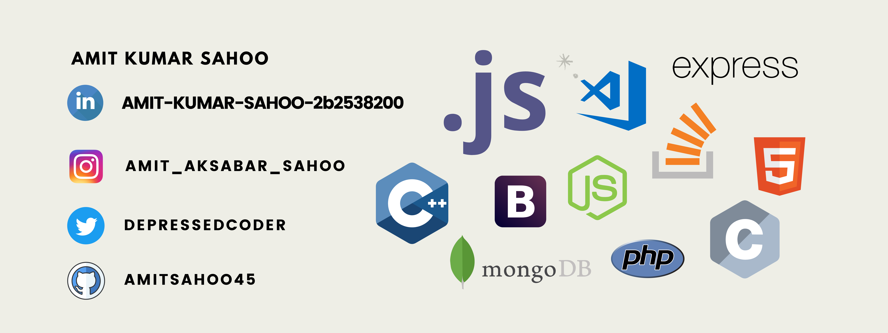

<h1 align="center"> I'm Amit Kumar Sahoo</h1>
<h4 align="center">
currently in 2nd Year pursuing B.Tech in Computer Science and Engineering at Kalinga Institue of Industrial Technology. 
I'm a Front-end Web Developer(React.Js) and a Competetive Programmer. 
</h4>

  

 
<h2 align="center"><u>My skills</u></h2>

 
 

 

 

<h3 align="center">Connect with me:</h3>

 &nbsp;&nbsp;&nbsp;&nbsp;
&nbsp;&nbsp;&nbsp;&nbsp;

